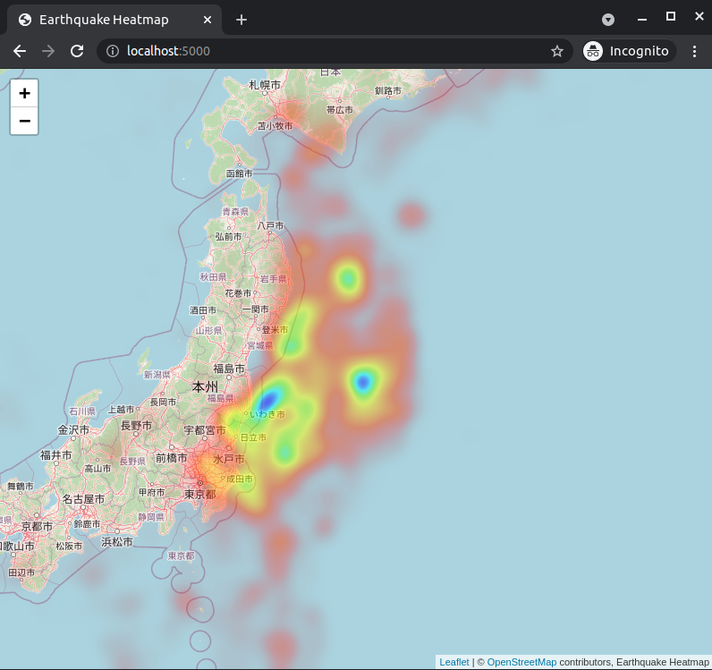

# Python Heatmap WMS Server

This implementation showcases rendering Geo data into a heatmap image
to serve in [WMS](https://en.wikipedia.org/wiki/Web_Map_Service) format.



**Why WMS?** If you are dealing with large datasets,
it might not be performant to render them in a lightweight client.
With the help of WMS layer,
the server takes care of the heatmap rendering for the large datasets and
the browser is only responsible to display the end PNG image.
WMS isn't the most ideal solution for every use case
because it is slow to deliver a large PNG to the client.

Since the heatmap normalization is based on the current tile,
[Leaflet.NonTiledLayer](https://github.com/ptv-logistics/Leaflet.NonTiledLayer)
is used for rendering a single tile for the entire layer.

* `heatmap.py` contains the heatmap bitmap image construction logic.
* `app.py` is a full example to create WMS heatmap server.
* The demo application is rendering earthquakes in Japan.

## Running the demo

Use docker to run the demo app.
```bash
# build the docker image
docker build -t heatmap .

# run the image
docker run -it --rm -p 5000:5000  heatmap
```

## License

Released under [the MIT license](LICENSE).
The dataset file `earthquakes.geojson` is taken from
[the USGS feed](http://earthquake.usgs.gov/earthquakes/feed/v1.0/geojson.php).
